# WebProject
## CoCo(Coding | Compile)
+ we will make coding & compile website where users can compile with web_compiler we made and solve problems

# UI
#### 메인 페이지
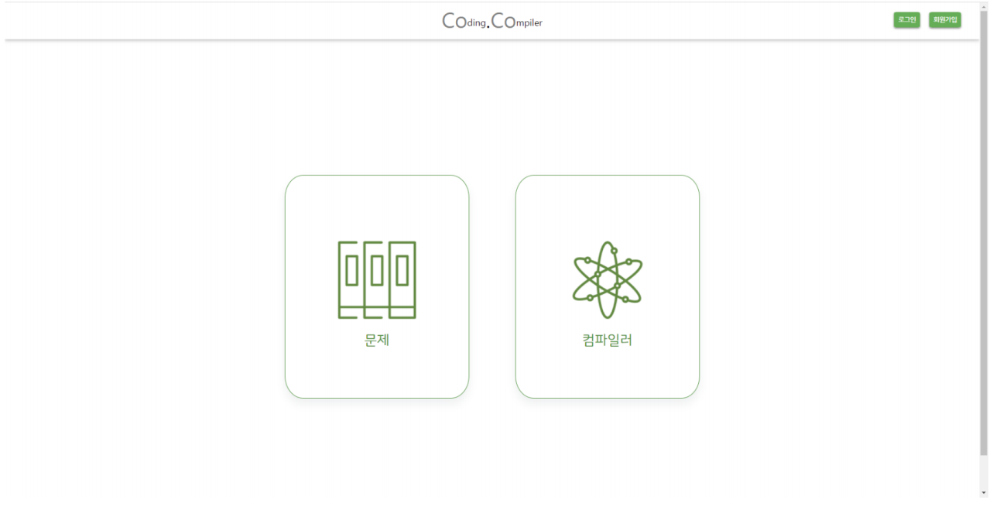

#### 로그인
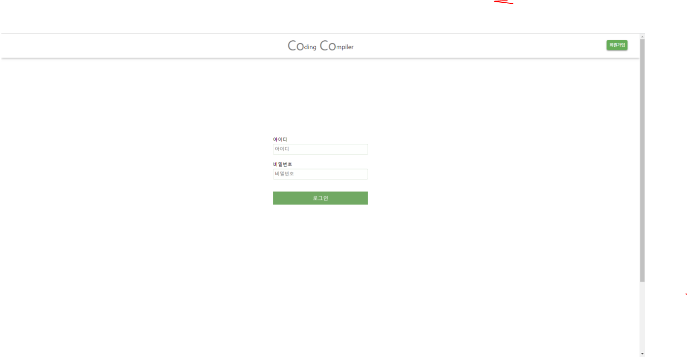

#### 회원가입
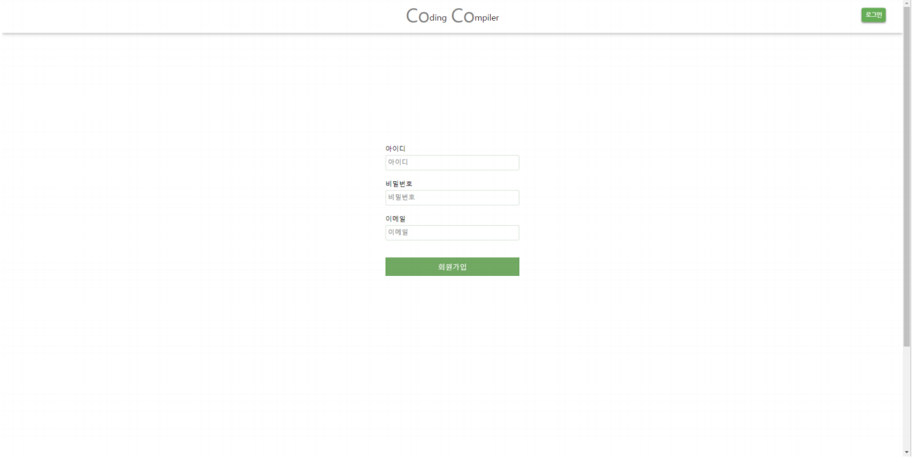

#### 컴파일러
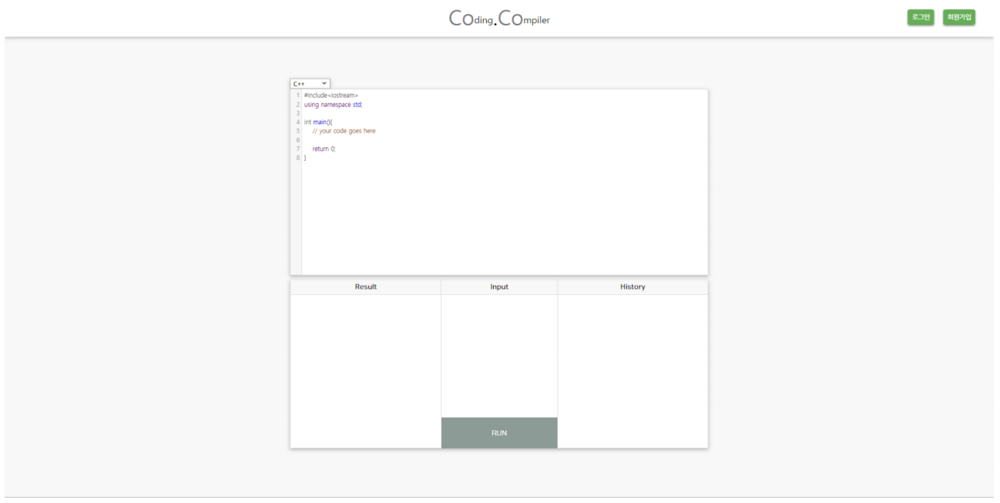
###### 컴파일러 - 언어 변경
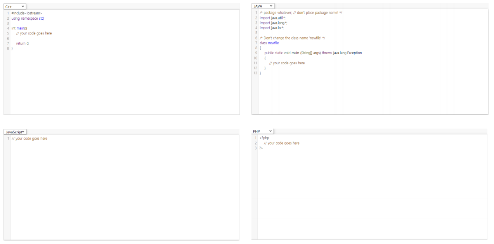
###### 컴파일러 - 실행
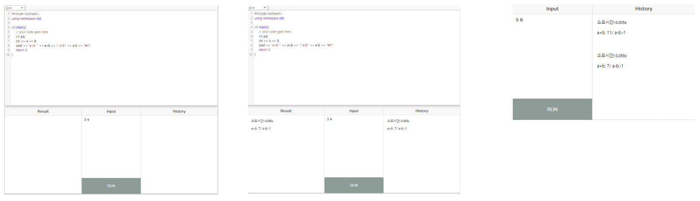

#### 문제목록
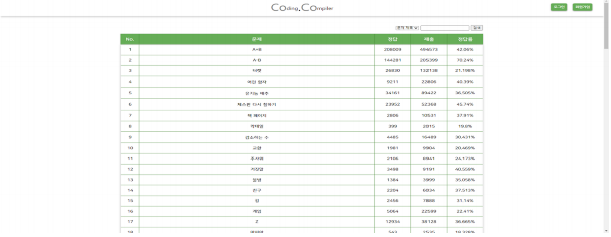

#### 문제 정보
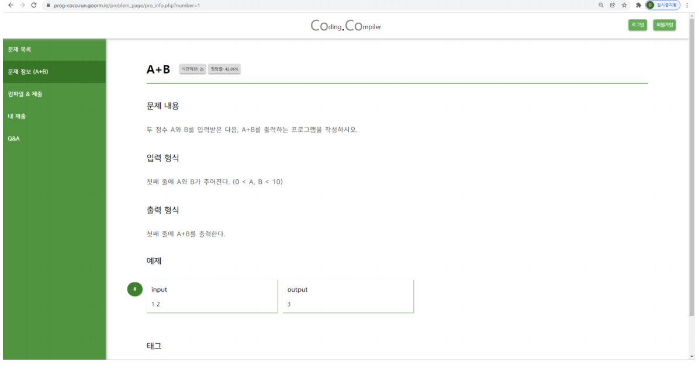
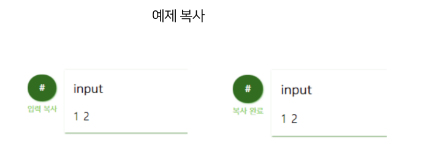

#### 컴파일, 제출

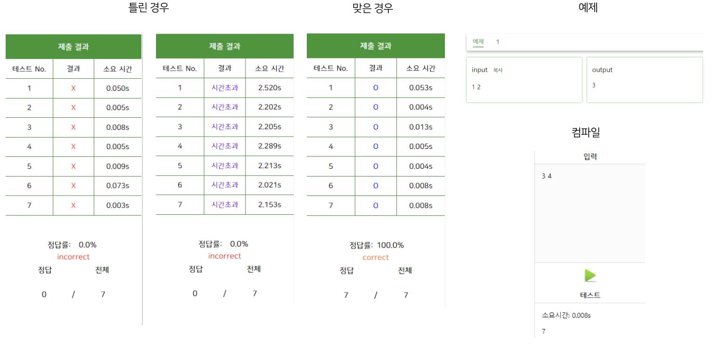

#### 내제출
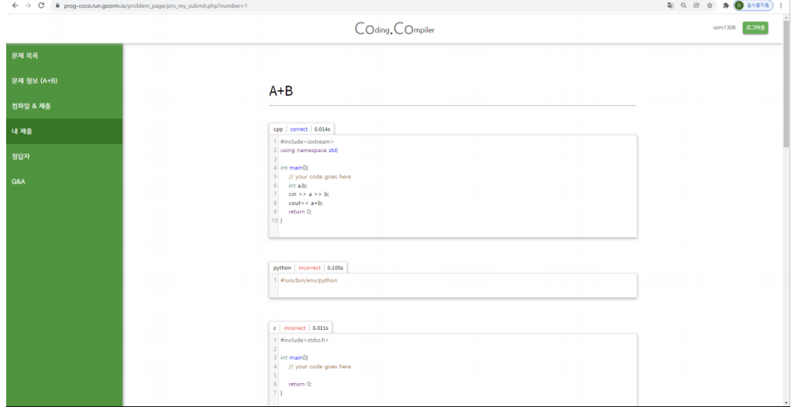

#### 정답자
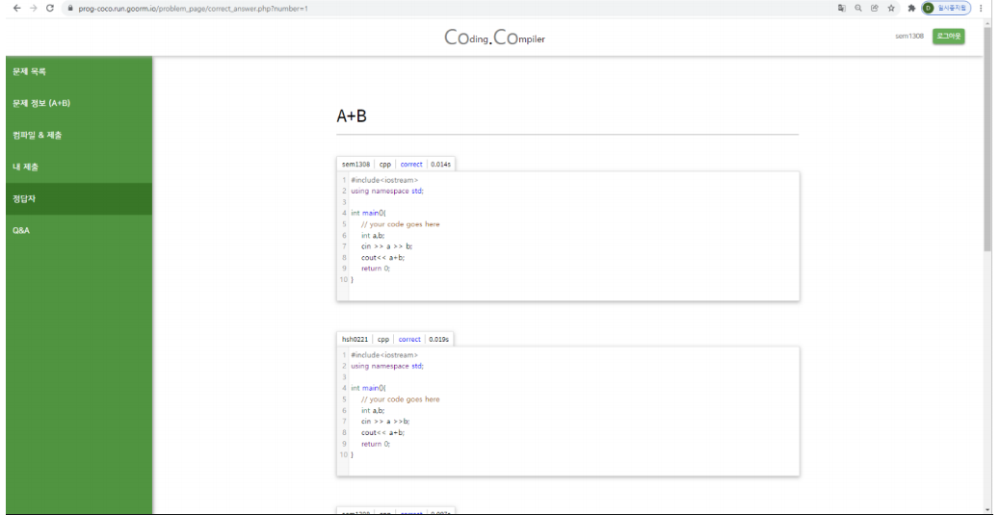

#### Q&A
