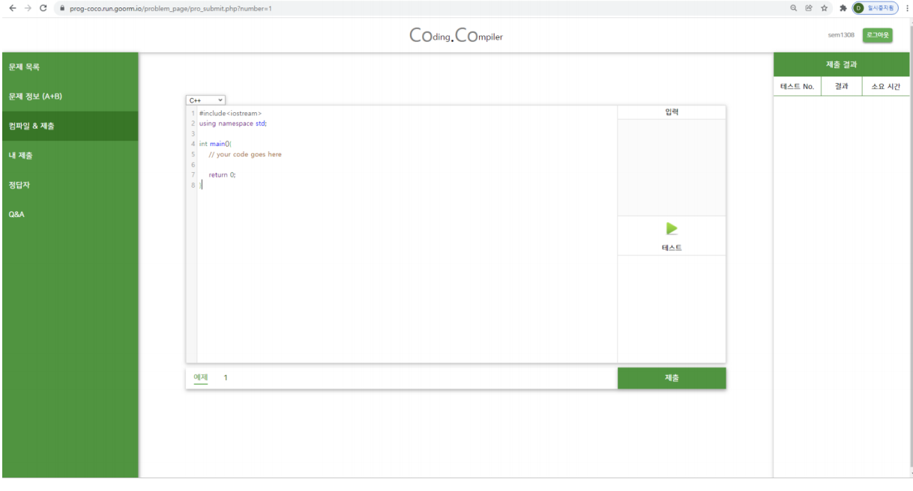
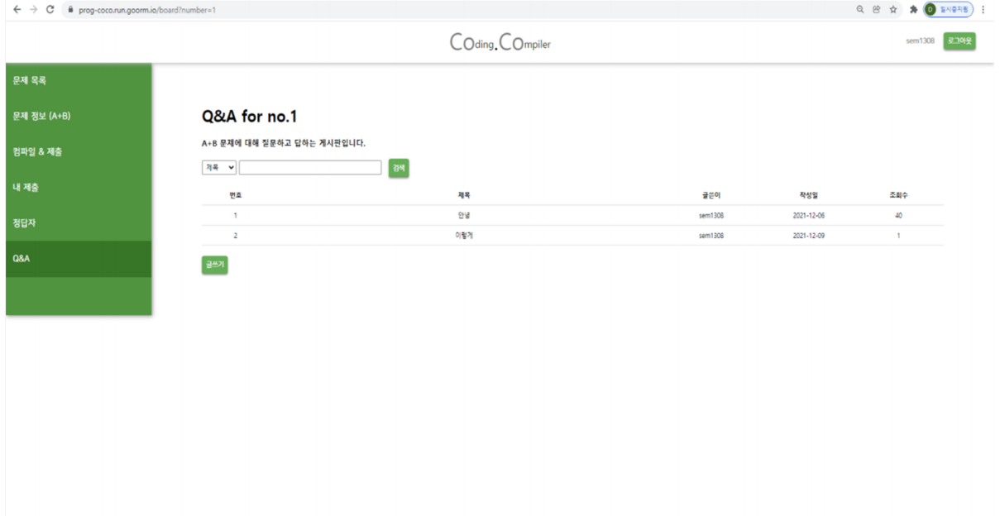

# WebProject
## CoCo(Coding | Compile)
+ we will make coding & compile website where users can compile with web_compiler we made and solve problems

# UI
#### 메인 페이지

#### 로그인

#### 회원가입

#### 컴파일러

###### 컴파일러 - 언어 변경

###### 컴파일러 - 실행

#### 문제목록

#### 문제 정보

#### 컴파일, 제출

#### 내제출

#### 정답자

#### Q&A
